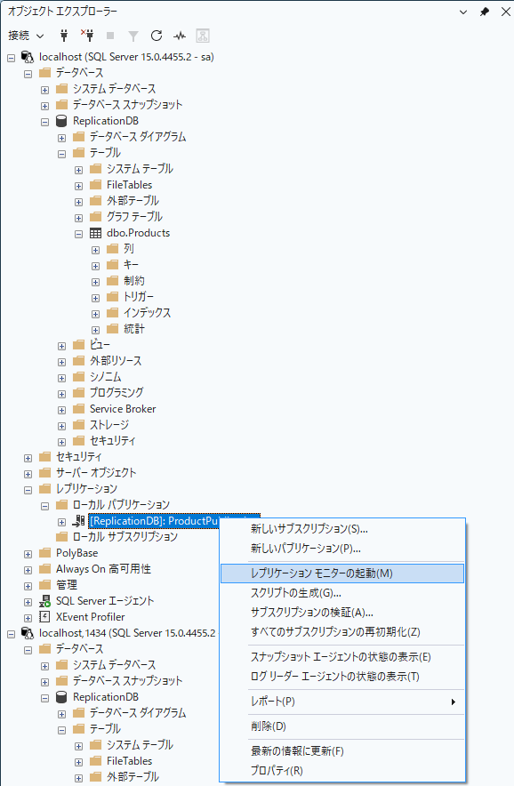
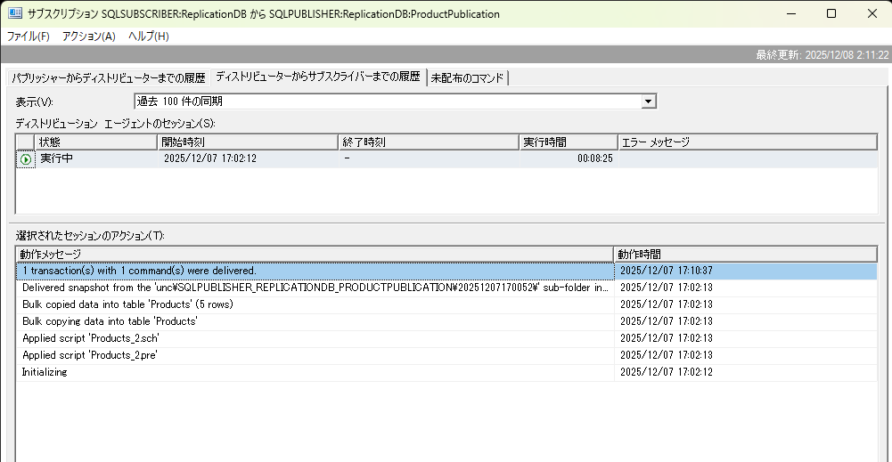

# SSMS GUI でのレプリケーション設定ガイド

このドキュメントでは、SQL Server Management Studio (SSMS) の GUI を使用してトランザクションレプリケーションを設定する手順を説明します。

**注意**: このリポジトリの SQL スクリプトは、この GUI 操作を自動化したものです。どちらの方法でも同じ結果が得られます。

## 前提条件

- SQL Server Management Studio (SSMS) がインストールされていること
- Publisher と Subscriber の SQL Server が稼働していること
- sa アカウント（または適切な権限を持つアカウント）の認証情報

## Docker 環境への接続方法

このリポジトリの Docker 環境に SSMS で接続する場合：

### Publisher への接続
- **サーバー名**: `localhost,1433` または `127.0.0.1,1433`
- **認証**: SQL Server 認証
- **ログイン**: `sa`
- **パスワード**: `YourStrong@Passw0rd`

### Subscriber への接続
- **サーバー名**: `localhost,1434` または `127.0.0.1,1434`
- **認証**: SQL Server 認証
- **ログイン**: `sa`
- **パスワード**: `YourStrong@Passw0rd`

---

## プッシュサブスクリプションの設定

### ステップ 1: ディストリビューターの構成

1. SSMS で **Publisher サーバー**（localhost,1433）に接続
2. オブジェクトエクスプローラーで「レプリケーション」フォルダを右クリック
3. **「ディストリビューションの構成」** を選択
4. ウィザードの各画面で以下を設定：

#### ディストリビューター画面
- ✅ **「'サーバー名' を独自のディストリビューターとして機能させる」** を選択
- 「次へ」をクリック

#### スナップショットフォルダー画面
- デフォルトパスのまま、または任意のパスを指定
  - Docker 環境の場合: `/var/opt/mssql/ReplData`
- 「次へ」をクリック

#### ディストリビューションデータベース画面
- データベース名: `distribution`（デフォルト）
- データファイルとログファイルの場所: デフォルトのまま
- 「次へ」をクリック

#### パブリッシャー画面
- Publisher サーバーが有効になっていることを確認
- 「次へ」をクリック

#### ウィザードのアクション画面
- ✅ **「ディストリビューションを構成する」** にチェック
- 「次へ」をクリック

#### 完了画面
- 「完了」をクリック

**結果**: `distribution` データベースが作成され、サーバーがディストリビューターとして構成されます。

---

### ステップ 2: パブリケーションの作成

1. Publisher の「レプリケーション」フォルダを展開
2. **「ローカルパブリケーション」** を右クリック
3. **「新しいパブリケーション」** を選択
4. ウィザードの各画面で以下を設定：

#### パブリケーションデータベース画面
- **ReplicationDB** を選択
- 「次へ」をクリック

#### パブリケーションの種類画面
- ✅ **「トランザクションパブリケーション」** を選択
- 「次へ」をクリック

#### アーティクル画面
- ✅ **テーブル: dbo.Products** にチェック
- 「次へ」をクリック

#### アーティクルの問題画面
- 問題がなければ「次へ」をクリック

#### テーブル行のフィルター選択画面
- フィルターを追加しない場合は「次へ」をクリック

#### スナップショットエージェント画面
- ✅ **「スナップショットをすぐに作成し、サブスクリプションを初期化できる状態にしておく」**
- ✅ **「次のスケジュールでスナップショットエージェントを実行する」**
- スケジュール: デフォルト（毎日 午前 2:00）または任意
- 「次へ」をクリック

#### エージェントのセキュリティ画面
- **「セキュリティ設定」** をクリック
  - ✅ **「次の SQL Server ログインを使用する」**
  - ログイン: `sa`
  - パスワード: `YourStrong@Passw0rd`
  - 「OK」をクリック
- 「次へ」をクリック

#### ウィザードのアクション画面
- ✅ **「パブリケーションを作成する」** にチェック
- 「次へ」をクリック

#### パブリケーション名画面
- パブリケーション名: **ProductPublication**
- 「完了」をクリック

**結果**: `ProductPublication` パブリケーションが作成され、スナップショットが生成されます。

---

### ステップ 3: プッシュサブスクリプションの作成

1. 「ローカルパブリケーション」→「ProductPublication」を右クリック
2. **「新しいサブスクリプション」** を選択
3. ウィザードの各画面で以下を設定：

#### パブリケーション画面
- 選択されているパブリケーション: ProductPublication
- 「次へ」をクリック

#### ディストリビューションエージェントの場所画面
- ✅ **「ディストリビューターですべてのエージェントを実行する（プッシュサブスクリプション）」**
- 「次へ」をクリック

#### サブスクライバー画面
- **「サブスクライバーの追加」** → **「SQL Server サブスクライバーの追加」** をクリック
- サーバー接続ダイアログで:
  - サーバー名: Subscriber のホスト名（Docker の場合は `sqlsubscriber` または `localhost,1434`）
  - 認証: SQL Server 認証
  - ログイン: `sa`
  - パスワード: `YourStrong@Passw0rd`
  - 「接続」をクリック
- サブスクリプションデータベース: **ReplicationDB** を選択
- 「次へ」をクリック

#### ディストリビューションエージェントのセキュリティ画面
- **「...」ボタン** をクリック
  - ✅ **「次の SQL Server ログインを使用する」**
  - ログイン: `sa`
  - パスワード: `YourStrong@Passw0rd`
  - サブスクライバーへの接続方法: **「SQL Server ログインを使用する」**
  - ログイン: `sa`
  - パスワード: `YourStrong@Passw0rd`
  - 「OK」をクリック
- 「次へ」をクリック

#### 同期スケジュール画面
- エージェント スケジュール:
  - ✅ **「継続的に実行」** （推奨）
  - または **「スケジュールを定義する」** で間隔を指定（例: 5分ごと）
- 「次へ」をクリック

#### サブスクリプションの初期化画面
- 初期化タイミング: **「すぐに」** を選択
- 「次へ」をクリック

#### ウィザードのアクション画面
- ✅ **「サブスクリプションを作成する」** にチェック
- 「次へ」をクリック

#### 完了画面
- 「完了」をクリック

**結果**: プッシュサブスクリプションが作成され、データのレプリケーションが開始されます。

---

## プルサブスクリプションの設定

### ステップ 1〜2: ディストリビューターとパブリケーションの作成

プッシュサブスクリプションと同じ手順で実行してください。

---

### ステップ 3: プルサブスクリプションの作成

#### Publisher 側の操作

1. Publisher の「ローカルパブリケーション」→「ProductPublication」を右クリック
2. **「新しいサブスクリプション」** を選択
3. ウィザードの各画面で以下を設定：

##### パブリケーション画面
- 選択されているパブリケーション: ProductPublication
- 「次へ」をクリック

##### ディストリビューションエージェントの場所画面
- ✅ **「各サブスクライバーで、エージェントをそのサブスクライバーで実行する（プルサブスクリプション）」**
- 「次へ」をクリック

##### サブスクライバー画面
- **「サブスクライバーの追加」** → **「SQL Server サブスクライバーの追加」**
- サーバー接続:
  - サーバー名: `sqlsubscriber` または `localhost,1434`
  - 認証: SQL Server 認証（sa）
- サブスクリプションデータベース: **ReplicationDB**
- 「次へ」をクリック

##### ディストリビューションエージェントのセキュリティ画面
- 認証情報を設定
- 「次へ」をクリック

##### 同期スケジュール画面
- ✅ **「スケジュールを定義する」** を選択
  - 「変更」をクリック
  - 頻度: **「毎日」**
  - 実行時刻: **09:00:00**（朝9時）
  - 間隔: **「分」** で **30分ごと**
  - 「OK」をクリック
- 「次へ」をクリック

##### サブスクリプションの初期化画面
- 初期化タイミング: **「すぐに」**
- 「次へ」をクリック

##### 完了
- 「完了」をクリック

#### Subscriber 側での確認（オプション）

1. SSMS で **Subscriber サーバー**（localhost,1434）に接続
2. 「レプリケーション」→「ローカルサブスクリプション」を展開
3. 作成されたサブスクリプションが表示される
4. サブスクリプションを右クリック:
   - **「同期の状態の表示」**: 手動で同期を実行
   - **「プロパティ」**: スケジュールや設定を変更

---

## レプリケーションの確認

### 1. レプリケーションモニターで確認

#### レプリケーションモニターの起動方法

1. Publisher で「レプリケーション」→「ローカル パブリケーション」を展開
2. パブリケーション（例: ProductPublication）を右クリック
3. **「レプリケーション モニターの起動」** を選択



#### レプリケーション履歴の確認

レプリケーションモニターでは以下の情報を確認できます:
- ✅ 状態: **「実行中」**
- ✅ パフォーマンス: **「良好」**
- ✅ 配信トランザクション数
- ✅ 最終同期時刻

**ディストリビューション エージェントのセクション（下部）** には、詳細な履歴が表示されます:
- 初期スナップショット適用の履歴
- トランザクション配信の履歴（例: "1 transaction(s) with 1 command(s) were delivered."）
- 各操作のタイムスタンプ



このスクリーンショットでは:
- 初期スナップショット（5行のデータ）が正常に配信
- Publisher での UPDATE 操作が Subscriber に配信されたことが確認できます

### 2. データのレプリケーションをテスト

#### Publisher でデータを挿入
```sql
USE ReplicationDB;
INSERT INTO Products (ProductName, Price) 
VALUES ('Test Product', 99.99);
```

#### Subscriber で確認
```sql
USE ReplicationDB;
SELECT * FROM Products 
WHERE ProductName = 'Test Product';
```

数秒〜数分後にデータが表示されれば成功です！

---

## トラブルシューティング（GUI版）

### SQL Server Agent が起動していない

1. オブジェクトエクスプローラーで「SQL Server エージェント」を確認
2. ❌ 赤いアイコンの場合は停止中
3. 右クリック →「開始」

### スナップショットが生成されない

1. 「レプリケーション」→「ローカルパブリケーション」→「ProductPublication」を右クリック
2. **「スナップショット エージェントの状態の表示」** を選択
3. 「開始」ボタンをクリック

### サブスクリプションが同期されない

1. レプリケーションモニターを開く
2. サブスクリプションを右クリック
3. **「詳細を表示」** でエラーメッセージを確認
4. よくある原因:
   - Subscriber への接続エラー → 認証情報を確認
   - スナップショットが見つからない → スナップショットを再生成
   - SQL Server Agent が停止 → Agent を起動

---

## スケジュール設定の詳細（プル専用）

プルサブスクリプションのスケジュール設定は特に重要です。

### 推奨設定（夜間停止する部門サーバー）

1. Subscriber の「ローカルサブスクリプション」→サブスクリプションを右クリック
2. **「プロパティ」** を選択
3. 「スケジュール」タブ:
   - 頻度: **「毎日」**
   - 実行時刻: **09:00:00**
   - 間隔: **「分単位」で「30」分ごと**

**動作**:
- 毎朝 9:00 AM に最初の同期
- その後 9:30, 10:00, 10:30... と 30分ごとに継続

### より高頻度な同期が必要な場合

- 間隔を **15分** に変更
- または「継続的に実行」を選択（常時監視）

---

## GUI と スクリプトの使い分け

### GUI が適している場合
- ✅ 初めてレプリケーションを設定する
- ✅ 設定内容を視覚的に確認したい
- ✅ 1〜2台のサーバーのみ設定する
- ✅ スケジュール調整を頻繁に行う

### スクリプトが適している場合
- ✅ 複数のサーバーに同じ設定を展開する
- ✅ 設定をバージョン管理したい
- ✅ CI/CD パイプラインに組み込みたい
- ✅ 環境の再構築を自動化したい

**推奨アプローチ**:
1. まず GUI で設定を作成して動作確認
2. 設定が固まったらスクリプト化
3. 他の環境にはスクリプトで展開

---

## 参考: GUI 操作とスクリプトの対応表

| GUI 操作 | 実行される T-SQL |
|----------|-----------------|
| ディストリビューションの構成 | `sp_adddistributor`, `sp_adddistributiondb` |
| 新しいパブリケーション | `sp_addpublication`, `sp_addpublication_snapshot` |
| アーティクルの追加 | `sp_addarticle` |
| 新しいサブスクリプション（プッシュ） | `sp_addsubscription` (type='push') |
| 新しいサブスクリプション（プル） | `sp_addsubscription` (type='pull'), `sp_addpullsubscription_agent` |
| スナップショットの生成 | `sp_startpublication_snapshot` |

SSMS の「スクリプト」ボタンを使うと、GUI 操作と同等の T-SQL を生成できます。

---

## まとめ

- SSMS の GUI を使えば、コードを書かずにレプリケーションを設定できます
- ウィザード形式なので、初心者でも迷わず設定可能
- レプリケーションモニターで視覚的に状態確認ができます
- 設定内容は SQL Server（サーバー側）に保存されるため、SSMS を閉じても動作し続けます
- 本番環境では GUI で設定した後、スクリプト化することを推奨します

詳細な SQL スクリプトについては、各フォルダの `*-setup.sql` ファイルを参照してください。
